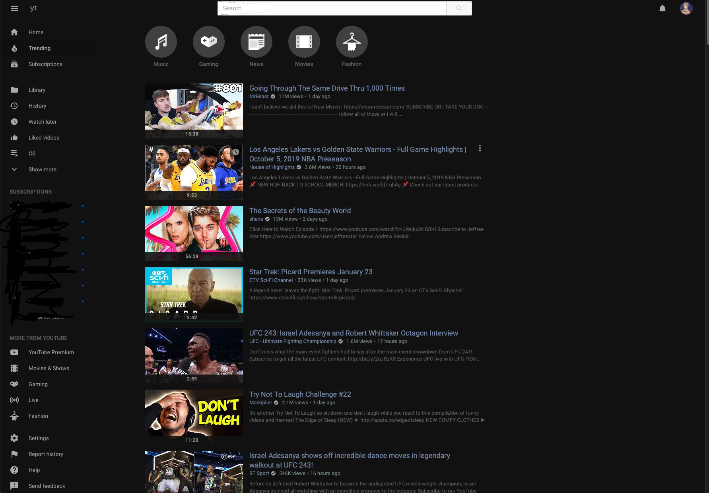
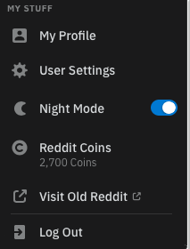

# Safari-Style-Sheet
google.com - dark themed.  (Still working on some font colors)
youtube.com - see below
reddit.com - see below.

Feel free to make changes and share it out.  Since Apple in it's infinite wisdom has decided some of the blockers and customization extensions are no longer allowed at this time.   This should help till things get back up and going, that is if they ever allow for those extensions.

Youtube - now all dark.  This is without dark theme enabled.  So that users do not have to sign into youtube to have this feature.   .CSS file can be changed to any colors that you would like.
Have completed cosmetic filtering on YouTube.  If there is any other suggestions feel free to add them as a comment.

Added Reddit - cosmetic filtering applied.  Made it a little less cluttered.  Here is the landing page and the edited Menu. This is still a WIP.

PLEASE NOTE - I HAVE REDDIT PREMIUM - Ads are blocked by default for Prem users.  

