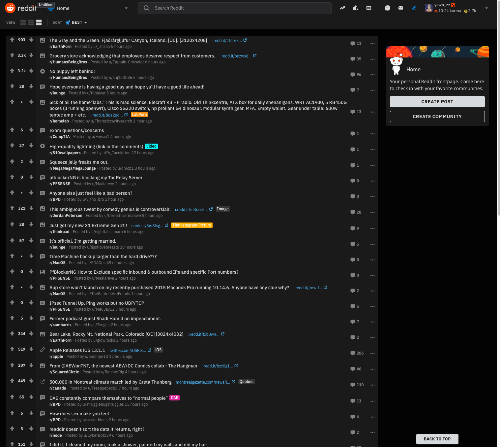

# Safari StyleSheet

Revised and added css selectors/elements from blocklists to remove ads and some other junk.

Feel free to make changes and share it out.  Since Apple in it's infinite wisdom has decided some of the blockers and customization extensions are no longer allowed at this time.   This should help till things get back up and going, that is if they ever allow for those extensions.

Youtube - changed the time of video to be centered and changed to a different youtube logo - one that was hand drawn.

Added Reddit - cosmetic filtering applied.  Made it a little less cluttered.  Here is the landing page and the edited Menu. This is still a WIP.

PLEASE NOTE - I HAVE REDDIT PREMIUM - Ads are blocked by default for Prem users.  

If you want to collaborate and add anything to this feel free to submit changes.  Together we can make this better.  I will slowly continue updating as I go along and find more annoyances.

